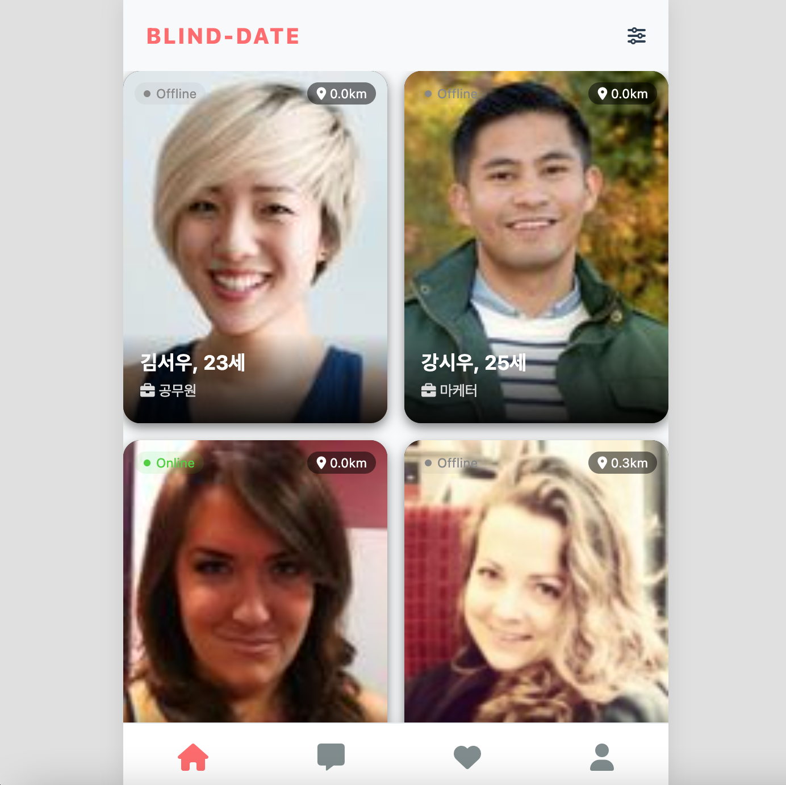
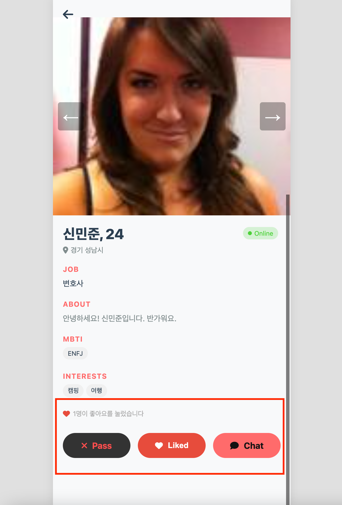
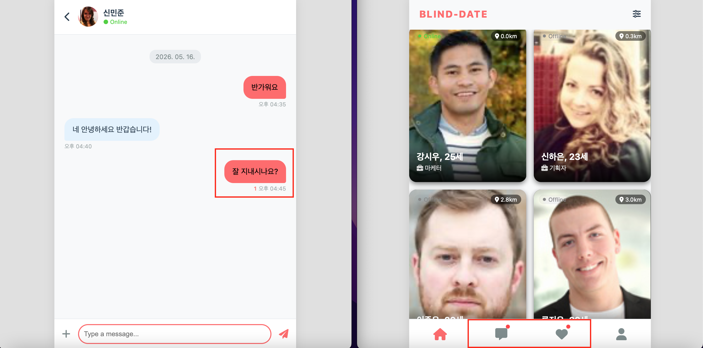
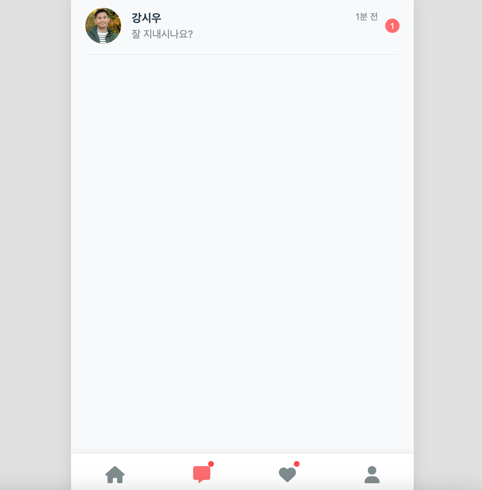
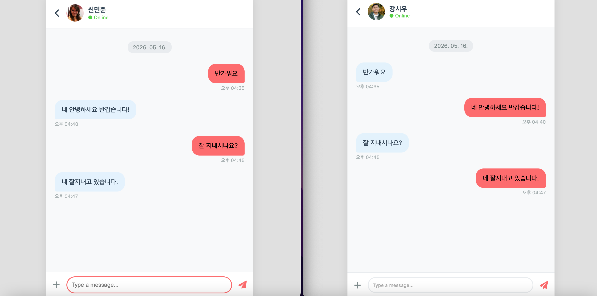
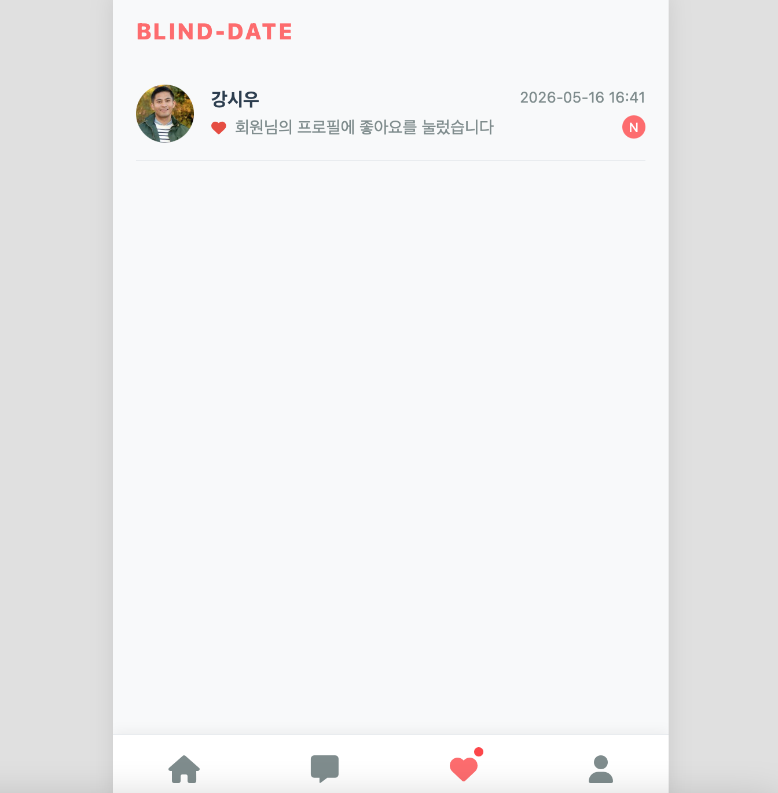
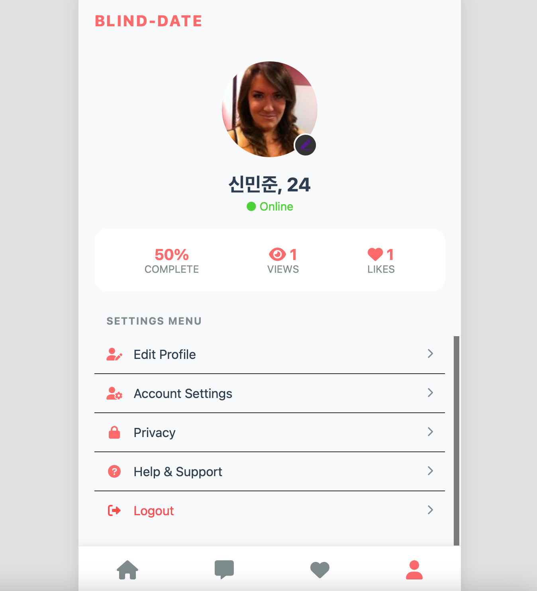
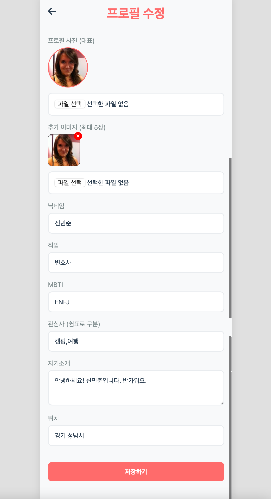
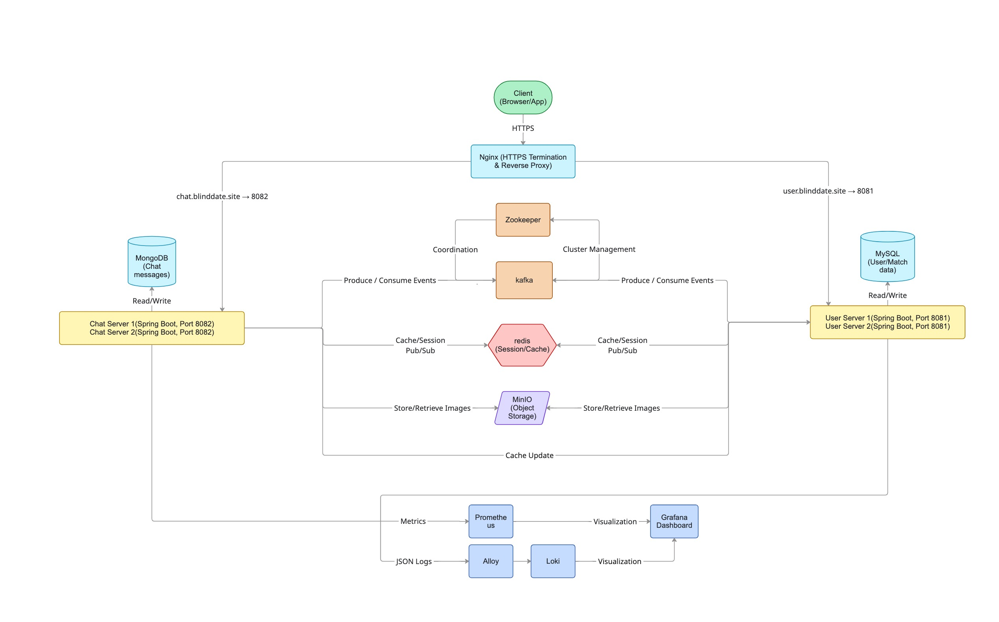

# Blind Date – 소개팅 실시간 매칭 & 채팅 MSA 백엔드

**Blind-Date**는 주변에 있는 사람들을 기반으로 새로운 인연을 만날 수 있는 소개팅 앱입니다.

내 주변의 가까운 사용자 목록을 확인하고 관심 있는 사람과 바로 매칭할 수 있습니다.
매칭된 상대와 실시간 채팅을 통해 자연스럽게 대화를 시작할 수 있습니다.

## 주요 화면

<div align="center">
  <table>
    <tr>
      <td align="center" width="50%" valign="top">
        <b>1. 메인화면</b><br/><br/>
        
      </td>
      <td align="center" width="50%" valign="top">
        <b>2. 상대 유저 디테일 화면</b><br/><br/>
        
      </td>
    </tr>
    <tr>
      <td align="center" width="50%" valign="top">
        <b>3. 좋아요 버튼 및 채팅 시 알림</b><br/><br/>
        
      </td>
      <td align="center" width="50%" valign="top">
        <b>4. 채팅방 목록</b><br/><br/>
        
      </td>
    </tr>
    <tr>
      <td align="center" width="50%" valign="top">
        <b>5. 두 유저 채팅 진행</b><br/><br/>
        
      </td>
      <td align="center" width="50%" valign="top">
        <b>6. 좋아요 목록</b><br/><br/>
        
      </td>
    </tr>
    <tr>
      <td align="center" width="50%" valign="top">
        <b>7. 내 프로필 정보</b><br/><br/>
        
      </td>
      <td align="center" width="50%" valign="top">
        <b>8. 내 정보 수정</b><br/><br/>
        
      </td>
    </tr>
  </table>
</div>

## 라이브 데모

> **Note**: 라이브 배포 환경은 현재 중단된 상태입니다.
>
> Docker Compose로 전체 MSA 환경을 로컬에서 즉시 실행 가능합니다.

**이전 운영 정보**
- URL: ~~https://user.blind-date.site~~
- 테스트 계정: user@test.com / 1234

**로컬 실행 방법**
```bash
# Docker Compose로 전체 시스템 실행 (MySQL, MongoDB, Redis, Kafka, MinIO 포함)
docker-compose up -d

# Health Check
curl http://localhost:8081/api/v1/users/health
curl http://localhost:8082/api/v1/chats/health
```
---

## 📋 목차
1. [Quick Start](#-quick-start)
2. [주요 기능](#-주요-기능)
3. [아키텍처](#-아키텍처)
4. [기술 스택](#-기술-스택)
5. [프로젝트 구조](#-프로젝트-구조)
6. [데이터베이스 설계](#-데이터베이스-설계)
7. [인프라 구성](#-인프라-구성)
8. [성능 최적화](#-성능-최적화--아키텍처-결정)
9. [신뢰성 & 보안](#️-신뢰성--보안)
10. [개발 가이드](#-개발-가이드)
11. [배포](#-배포)
12. [모니터링 & 로깅](#-모니터링--로깅)
13. [주요 성과](#-주요-성과)
14. [향후 계획](#-향후-계획)

---

## 🚀 Quick Start

### 사전 요구사항
- Docker & Docker Compose
- Java 17 (로컬 개발 시)
- Gradle 8.x (로컬 개발 시)

### 전체 환경 실행
```bash
# 1. 저장소 클론
git clone https://github.com/your-repo/blind-date.git
cd blind-date

# 2. 환경 변수 설정
cp .env.example .env  # .env 파일 수정 필요

# 3. 전체 인프라 및 애플리케이션 실행
docker-compose up -d

# 4. 로그 확인
docker-compose logs -f user-server-1 chat-server-1

# 5. Health Check
curl http://localhost:8081/api/v1/users/health
curl http://localhost:8082/api/v1/chats/health
```

### 로컬 개발 (개별 서버 실행)
```bash
# User Server 실행 (MySQL, Redis, Kafka, MinIO 필요)
./gradlew :user-server:bootRun

# Chat Server 실행 (MongoDB, Redis, Kafka, MinIO 필요)
./gradlew :chat-server:bootRun
```

---

## ✨ 주요 기능

### 사용자 관리
- **회원가입/로그인**: JWT 기반 인증, 자동 로그인 지원
- **프로필 관리**: MinIO를 활용한 다중 이미지 업로드, MBTI·관심사·직업 정보
- **위치 기반 검색**: 내 주변 사용자 목록 조회 (위도/경도 기반)

### 매칭 시스템
- **좋아요 기능**: 관심 있는 사용자에게 좋아요 전송
- **SSE 실시간 알림**: 좋아요 수신 시 Server-Sent Events로 실시간 알림
- **매칭 성공**: 상호 좋아요 시 채팅방 자동 생성

### 실시간 채팅
- **WebSocket (STOMP)**: 1:1 실시간 채팅
- **읽음 표시**: 메시지 읽음/안 읽음 상태 추적
- **채팅 이미지**: MinIO를 통한 이미지 메시지 전송
- **채팅 알림**: SSE를 통한 새 메시지 도착 알림
- **온/오프라인 상태**: Redis 기반 사용자 실시간 접속 상태 표시

### 시스템 특징
- **MSA 아키텍처**: User/Chat 도메인 분리로 독립적 확장
- **서버 이중화**: Nginx 로드밸런싱으로 각 서버 2대씩 운영
- **이벤트 기반 통신**: Kafka를 통한 서비스 간 느슨한 결합
- **실시간성**: Redis Pub/Sub + WebSocket 조합
- **통합 모니터링**: Prometheus, Grafana, Loki를 통한 메트릭/로그 통합 관찰

---

## 🏗 아키텍처

`user-server`와 `chat-server`를 분리하고, Kafka 이벤트와 Redis·MongoDB·MySQL·MinIO를 활용해 **느슨한 결합 + 수평 확장**이 가능한 구조로 설계했습니다.



### MSA 구조

**User Server** (포트 8081)
- 역할: 유저/프로필/인증 도메인
- 주요 기능: JWT 인증, 프로필 관리, 위치 기반 검색, 좋아요
- 기술: MySQL (JPA + QueryDSL), Redis, Kafka Producer, MinIO

**Chat Server** (포트 8082)
- 역할: 실시간 채팅/채팅방 도메인
- 주요 기능: WebSocket 채팅, 읽음 표시, 이미지 메시지
- 기술: MongoDB, Redis Pub/Sub, Kafka Consumer, MinIO

**서비스 간 통신**
- HTTP 대신 **Kafka 이벤트 기반 비동기 통신**으로 느슨한 결합 구현
- User 서버 변경사항을 Chat 서버가 Kafka로 구독하여 데이터 동기화

---

## 🛠 기술 스택

| 구분 | 기술 | 용도                                   |
|------|------|--------------------------------------|
| **언어·프레임워크** | Java 17, Spring Boot 3.x | 백엔드 API·비즈니스 로직                      |
| **아키텍처** | MSA, 멀티 모듈(Gradle) | 유저 서버 / 채팅 서버 분리                     |
| **DB** | MySQL 8, MongoDB 7 | 유저·매칭(정합성) / 채팅 메시지(대량·유연 스키마)       |
| **캐시·메시지** | Redis 7, Apache Kafka | 세션·캐시·Pub/Sub·실시간성 / 서버 간 이벤트 비동기 전달 |
| **파일 저장** | MinIO | 프로필·채팅 이미지 오브젝트 스토리지                 |
| **실시간 통신** | WebSocket (STOMP) | 채팅 실시간 송수신                           |
| **인증** | Spring Security, JWT | 로그인·API 인증                           |
| **검색·쿼리** | QueryDSL, Spring Data JPA | 복잡 조회·타입 세이프 쿼리                      |
| **API 문서** | Springdoc OpenAPI (Swagger) | API 명세·테스트                           |
| **인프라·배포** | Docker, Docker Compose, Nginx | 컨테이너화, HTTPS·로드밸런싱, 수평 확장            |
| **모니터링·로깅** | Prometheus, Grafana, Loki, Alloy | 메트릭 수집·대시보드·로그 수집·통합 조회              |

---

## 📁 프로젝트 구조

<pre>
blind-date/
├── user-server/                    # 유저 도메인 API 서버 (MySQL, JPA, Kafka, MinIO)
│   ├── src/main/
│   │   ├── java/com/project/blinddate/
│   │   │   ├── common/             # API 경로 상수, 공통 DTO
│   │   │   └── user/
│   │   │       ├── config/         # Security, Kafka, MinIO, QueryDSL, CORS
│   │   │       ├── controller/     # REST API · Thymeleaf 뷰
│   │   │       ├── domain/         # JPA Entity (User, UserImage, UserLikes, UserViews)
│   │   │       ├── dto/            # Request/Response DTO
│   │   │       ├── exception/      # 전역 예외 처리
│   │   │       ├── filter/         # 요청 로깅
│   │   │       ├── logger/         # 커스텀 로거, MDC, JSON 로그
│   │   │       ├── mapper/         # MapStruct (Entity ↔ DTO)
│   │   │       ├── repository/     # JPA Repository, QueryDSL
│   │   │       ├── security/       # JWT 토큰 발급·검증
│   │   │       ├── service/        # 비즈니스 로직, Kafka Producer
│   │   │       └── aop/            # 활동 로깅 AOP
│   │   └── resources/
│   │       ├── db/migration/       # Flyway SQL 마이그레이션
│   │       ├── templates/          # Thymeleaf HTML
│   │       ├── static/             # CSS, JS
│   │       └── application.yaml
│   └── build.gradle
│
├── chat-server/                    # 채팅 도메인 API · WebSocket 서버
│   ├── src/main/
│   │   ├── java/com/project/blinddate/
│   │   │   ├── common/             # API 경로 상수, 공통 DTO
│   │   │   └── chat/
│   │   │       ├── config/         # Security, MongoDB, Redis, Kafka, WebSocket
│   │   │       ├── controller/     # REST API · WebSocket · Thymeleaf
│   │   │       ├── domain/         # MongoDB Document (ChatRoom, ChatMessage)
│   │   │       ├── dto/            # Request/Response DTO
│   │   │       ├── exception/      # 전역 예외 처리
│   │   │       ├── external/       # User 서버 Feign 클라이언트
│   │   │       ├── filter/         # 요청 로깅
│   │   │       ├── logger/         # 커스텀 로거, MDC
│   │   │       ├── mapper/         # MapStruct
│   │   │       ├── migration/      # Mongock 변경 로그
│   │   │       ├── repository/     # MongoDB Repository
│   │   │       ├── service/        # 채팅 로직, Kafka Consumer, Redis Pub/Sub
│   │   │       └── aop/            # 캐싱 AOP
│   │   └── resources/
│   │       ├── templates/          # Thymeleaf HTML
│   │       ├── static/             # CSS, JS
│   │       └── application.yaml
│   └── build.gradle
│
├── monitoring/                     # Prometheus, Grafana, Loki, Alloy 설정
├── nginx/                          # Nginx 설정 (HTTPS, 리버스 프록시)
├── docker-compose.yml
├── build.gradle
└── settings.gradle
</pre>

---

## 💾 데이터베이스 설계

### User Server (MySQL)

**정합성이 중요한** 유저·매칭은 MySQL DB를 선택했습니다.

| 테이블 | 설명 | 관계 |
|--------|------|------|
| **users** | 회원 정보 (이메일, 비밀번호 해시, 닉네임, 성별, 생년월일, MBTI, 관심사, 프로필 이미지 URL, 직업, 소개, 위치·위도·경도) | - |
| **user_images** | 유저별 추가 이미지 (이미지 URL, 순서) | `users` 1:N `user_images` (user_id FK, CASCADE 삭제) |
| **user_likes** | 유저 간 좋아요 관계 (발신자, 수신자, 생성 시각) | `users` 1:N `user_likes` (from_user_id, to_user_id FK) |
| **user_views** | 유저 프로필 조회 이력 (조회자, 대상자, 조회 시각) | `users` 1:N `user_views` (viewer_id, viewed_id FK) |

**주요 특징:**
- 좋아요 중복 방지: `(from_user_id, to_user_id)` 복합 UNIQUE 제약
- 위치 기반 검색: 위도/경도 인덱스 활용

### Chat Server (MongoDB)

채팅 메시지처럼 **대량·비정형** 데이터는 MongoDB를 선택했습니다.

| 컬렉션 | 설명 | 주요 필드 |
|--------|------|----------|
| **chat_rooms** | 채팅방 메타데이터 | participants (참여자 배열), createdAt, lastMessageAt |
| **chat_messages** | 채팅 메시지 | roomId, senderId, content, type (TEXT/IMAGE), createdAt, readBy (읽음 상태 배열) |
| **chat_user_info** | 유저 기본 정보 캐시 | userId, nickname, profileImageUrl (Kafka 이벤트로 동기화) |

**주요 특징:**
- 읽음 표시: `chat_messages.readBy` 배열에 읽은 유저 ID 저장
- 유저 정보 비정규화: User 서버 의존성 제거, Kafka 이벤트로 동기화
- 인덱스: `roomId + createdAt` 복합 인덱스로 메시지 조회 최적화
- 대용량 처리: MongoDB 페이징 쿼리 활용

---

## 🔧 인프라 구성

### 컨테이너 오케스트레이션 (`docker-compose.yml`)

`docker-compose.yml` 한 파일로 **DB·캐시·메시지브로커·앱**을 일괄 기동합니다.
모든 서비스는 `app-net` (bridge, 이름 `blind-date-app-net`) 네트워크에 연결되며, 환경 변수는 `.env`로 주입합니다.

#### 1. 데이터 저장소

| 서비스 | 이미지 | 설명 |
|--------|--------|------|
| **mysql-user** | `mysql:8.0` | User 서버 전용 DB. `utf8mb4`/`utf8mb4_unicode_ci`. 포트 3306, 볼륨 `mysql-user-data` |
| **mongo-chat** | `mongo:7.0` | Chat 서버 전용 MongoDB. 포트 27017, 볼륨 `mongo-chat-data` |
| **minio** | `minio/minio:latest` | 오브젝트 스토리지 (프로필·채팅 이미지). 포트 9000/9001, 볼륨 `minio-data` |

#### 2. Redis

| 서비스 | 설명 |
|--------|------|
| **redis** | `redis:7.2`. 포트 6379. Health Check: `redis-cli ping` (5초 간격). 볼륨 `redis-data` |

애플리케이션은 `SPRING_DATA_REDIS_HOST`, `SPRING_DATA_REDIS_PORT`로 연결합니다.

#### 3. Kafka

| 서비스 | 설명 |
|--------|------|
| **zookeeper** | `confluentinc/cp-zookeeper:7.6.1`. 클라이언트 포트 2181 |
| **kafka** | `confluentinc/cp-kafka:7.6.1`. 포트 9092. Health Check 10초 간격. 볼륨 `kafka-data` |

애플리케이션은 `SPRING_KAFKA_BOOTSTRAP_SERVERS: kafka:9092`로 연결하며, User/Chat 서버는 Kafka healthy 후 기동합니다.

#### 4. 게이트웨이 (Nginx)

| 항목 | 내용 |
|------|------|
| **이미지** | `nginx:1.25-alpine` |
| **의존성** | user-server-1, user-server-2, chat-server-1, chat-server-2 기동 후 시작 |
| **포트** | `80`, `443` 호스트 노출 |
| **볼륨** | `./nginx/nginx.conf` → `/etc/nginx/nginx.conf`, `./cert` → `/etc/nginx/ssl` |
| **네트워크 별칭** | `user.blind-date.site`, `chat.blind-date.site`, `minio.blind-date.site` |

HTTPS 종료 및 User/Chat/MinIO 도메인별 리버스 프록시·로드밸런싱을 담당합니다.

#### 5. 애플리케이션 서버 (수평 확장)

| 서비스 | 포트 | 의존성 | Health Check | 로그 볼륨 |
|--------|------|--------|--------------|-----------|
| **user-server-1, user-server-2** | 8081 | mysql, redis, kafka, minio | `/api/v1/users/health` (10s, 20s start) | `./logs/user-server-{1,2}` |
| **chat-server-1, chat-server-2** | 8082 | mongo, redis, kafka, minio | `/api/v1/chats/health` (10s, 20s start) | `./logs/chat-server-{1,2}` |

동일 이미지로 **User 2대, Chat 2대** 수평 확장하며, Nginx가 4개 인스턴스로 트래픽 분산합니다.

#### 6. 볼륨 · 네트워크 요약

- **Named Volumes**: `mysql-user-data`, `mongo-chat-data`, `redis-data`, `kafka-data`, `minio-data`
- **네트워크**: `app-net` (bridge, name: `blind-date-app-net`)

---

## ⚡ 성능 최적화 & 아키텍처 결정

### 1. WebSocket 서버 이중화 문제 해결

**문제**: 서버 이중화 시 WebSocket 메시지가 특정 서버에만 전달되어 다른 서버 클라이언트는 메시지 받지 못함

**해결: Redis Pub/Sub 패턴**
- 채팅 메시지 발송 시 Redis Pub/Sub로 모든 서버 인스턴스에 브로드캐스트
- 각 서버는 자신에게 연결된 WebSocket 클라이언트에게만 메시지 전달
- 서버가 다운되어도 다른 서버로 자동 재연결

### 2. 비동기 메시지 저장

**문제**: WebSocket 메시지 전송과 DB 저장을 동기로 처리하여 응답 속도 저하

**해결: Kafka를 통한 비동기 저장**
- WebSocket으로 메시지 즉시 전송 후, Kafka `chat-message-save` 토픽에 이벤트 발행
- Chat Server의 Kafka Consumer가 비동기로 MongoDB에 저장
- 응답 속도 향상 및 시스템 처리량 증대

### 3. 서비스 간 데이터 동기화

**초기 방식**: OpenFeign + Redis 캐시로 User 서버에서 사용자 정보 조회

**개선: Kafka 이벤트 기반 데이터 복제**
- User 서버에서 사용자 정보 변경 시 `user-info-updated` 이벤트 발행
- Chat 서버의 MongoDB에 필요한 사용자 정보(닉네임, 프로필 이미지) 비정규화 저장
- 서비스 간 HTTP 호출 제거로 결합도 감소, 장애 전파 차단

### 4. Redis 다층 캐싱 전략

**채팅방 메타데이터 캐싱** (`ChatRoomCacheService`):
```java
// 1차: Redis 캐시 조회 (TTL 24시간)
// 2차: MongoDB 조회 → Redis에 캐싱
// 캐시 키: chat:room:{roomId}:participants
```

**사용자 정보 캐싱** (`UserInfoCacheService`):
```java
// 1차: MongoDB 조회 (Chat Server 로컬)
// 2차: User Server HTTP 요청 (fallback)
// Kafka 이벤트로 캐시 무효화 (user-info-updated 토픽)
```

**성과**:
- 채팅방 참여자 조회 API 응답 시간 **200ms → 5ms**
- 서비스 간 HTTP 호출 **95% 감소**

### 5. 동시성 제어 최적화

**SSE (Server-Sent Events) 동시 접근 처리**:
```java
// user-server/service/UserSseService.java
private final Map<Long, List<SseEmitter>> emitters = new ConcurrentHashMap<>();
private final List<SseEmitter> emitterList = new CopyOnWriteArrayList<>();
```

**선택 이유**:
- `ConcurrentHashMap`: 읽기/쓰기 모두 빈번한 emitter 관리에 적합
- `CopyOnWriteArrayList`: SSE 브로드캐스트 시 iteration 중 수정 안전성 보장

**성과**: Lock-free 구조로 SSE 브로드캐스트 성능 향상, 멀티스레드 환경에서 안전성 확보

---

## 🛡️ 신뢰성 & 보안

### 신뢰성 & 고가용성

**1. Kafka Dead Letter Topic (DLT) 전략**
- 메시지 처리 실패 시 자동 재시도 (최대 3회)
- 재시도 실패 시 DLT로 격리하여 정상 메시지 처리 흐름 보호
- DLT 메시지는 별도 모니터링 및 수동 처리

**2. Redis 데이터 영속성**
- **RDB + AOF 이중 백업 전략**으로 데이터 손실 방지
- RDB 스냅샷: `save 900 1`, `300 10`, `60 10000`
- AOF: `appendonly yes`, `appendfsync everysec`
- 서버 재시작 시 데이터 복구 보장

**3. Health Check & 의존성 관리**
- 모든 서비스는 Health Check 엔드포인트 제공
- Docker Compose `depends_on` + `condition`으로 의존성 순서 보장
- 앱 서버는 DB/Kafka/Redis가 모두 준비된 후 기동

**4. 서버 이중화 & 로드밸런싱**
- User Server 2대, Chat Server 2대
- Nginx Upstream을 통한 라운드로빈 로드밸런싱
- 서버 1대 다운 시에도 서비스 지속

### 보안

**1. HTTPS 적용**
- mkcert를 통한 로컬 개발 인증서 생성
- Nginx에서 TLS 종료 (443 포트)
- HTTP는 HTTPS로 자동 리다이렉트

**2. 인증 & 인가**
- **JWT 기반 인증**: Access Token 방식, HttpOnly 쿠키로 토큰 전달 (XSS 방지)
- **Spring Security**: 인증 필요 API는 JWT 필터로 보호, 비밀번호는 BCrypt 해싱

**3. CORS 설정**
- 허용된 Origin만 요청 가능 (`CorsConfig`)
- Credentials 포함 요청 지원

**4. 환경 변수 관리**
- 민감 정보는 `.env` 파일로 분리
- `.env` 파일은 `.gitignore`로 버전 관리 제외

---

## 🧑‍💻 개발 가이드

### 빌드 & 테스트

```bash
# 전체 프로젝트 빌드
./gradlew build

# 특정 모듈 빌드
./gradlew :user-server:bootJar
./gradlew :chat-server:bootJar

# 테스트 실행
./gradlew test
./gradlew :user-server:test
./gradlew :chat-server:test
```

### 코드 규칙

1. **통일된 응답 형식**: 모든 컨트롤러는 `ResponseDto` 반환, JSON은 snake_case
2. **API 경로 상수**: `ApiPathConst.USER_API_PREFIX`, `ApiPathConst.CHAT_API_PREFIX` 사용
3. **예외 처리**: `CustomException` + `@RestControllerAdvice`로 전역 처리
4. **DTO 규칙**: `@JsonNaming(SnakeCaseStrategy.class)`, Bean Validation 사용
5. **트랜잭션**: 도메인별 `@Transactional` 명시적 사용
6. **Lombok**: `@Getter`, `@Builder`, `@RequiredArgsConstructor` (NO `@Setter`)

### 테스트 전략

- **JUnit 5 + Mockito + AssertJ**
- Given-When-Then 패턴
- 통합 테스트: `@SpringBootTest` + TestContainers 권장

### Git 브랜치 전략

- `main`: 배포 가능한 안정 버전
- `feature/bd-XXX_description`: 기능 개발 브랜치
- 기능 완료 후 `main`으로 병합

### DB 마이그레이션

- **User Server (Flyway)**: `user-server/src/main/resources/db/migration/V{version}__{description}.sql`
- **Chat Server (Mongock)**: `chat-server/src/main/java/.../migration/` 패키지에 Java 클래스

---

## 🚀 배포

### Docker Compose 배포

```bash
# 개발 환경
docker-compose up -d

# 운영 환경
docker-compose -f docker-compose.yml up -d
```

### 환경 변수 (.env)

```env
# MySQL
MYSQL_DATABASE=blind_date_user
MYSQL_ROOT_PASSWORD=your_password

# MongoDB
MONGO_DATABASE=blind_date_chat

# Redis
SPRING_DATA_REDIS_HOST=redis
SPRING_DATA_REDIS_PORT=6379

# Kafka
SPRING_KAFKA_BOOTSTRAP_SERVERS=kafka:9092

# MinIO
MINIO_ACCESS_KEY=minioadmin
MINIO_SECRET_KEY=minioadmin
MINIO_BUCKET=blind-date

# JWT
JWT_SECRET=your_jwt_secret_key_here
JWT_EXPIRATION=86400000

# Domain
COOKIE_DOMAIN=.blind-date.site
```

### 배포 체크리스트

- [ ] `.env` 파일 설정 확인
- [ ] HTTPS 인증서 생성 (`cert/` 디렉토리)
- [ ] Docker 볼륨 백업 (운영 환경)
- [ ] 방화벽 규칙 (80, 443 포트 오픈)
- [ ] DNS 설정 (user.blind-date.site, chat.blind-date.site)
- [ ] Health Check 확인
- [ ] Grafana 대시보드 확인

### AWS EC2 배포 참고

- HTTPS 설정, 도메인 연결 완료
- Docker Compose 기반 운영 환경 구성 (Redis, Kafka 단일 인스턴스)

---

## 📊 모니터링 & 로깅

### Prometheus

- `monitoring/prometheus/config/prometheus.yml`에서 User/Chat 서버 Actuator 메트릭 엔드포인트 스크랩
- 메트릭: JVM 메모리, HTTP 요청, DB 커넥션 풀 등

### Alloy + Loki

- Alloy 에이전트가 애플리케이션 로그 디렉터리 (`logs/`)를 tail하여 Loki로 전송
- JSON 형식 로그 (Logstash Logback Encoder)
- Grafana에서 로그·메트릭을 함께 조회할 수 있는 **Observability 스택** 구성

### Grafana

- 기본 데이터소스/대시보드 설정 파일 제공
- Spring Boot용 시스템 모니터링 대시보드 예시 포함

### 로그 종류

- **애플리케이션 로그**: 비즈니스 로직, 에러
- **SQL 로그**: P6Spy를 통한 쿼리 추적
- **요청 로그**: MDC를 활용한 요청 ID 추적

---

## 📈 주요 성과

### 구현 완료 기능

- ✅ **MSA 기반 서비스 분리**: User/Chat 도메인 독립 운영
- ✅ **실시간 채팅 시스템**: WebSocket + Redis Pub/Sub 기반
- ✅ **좋아요 & 매칭 시스템**: SSE를 통한 실시간 알림 포함
- ✅ **채팅 읽음 표시**: 미읽음 메시지 카운트 및 상태 추적
- ✅ **자동 로그인**: JWT 토큰 기반 세션 유지
- ✅ **서버 이중화**: User/Chat 각 2대 + Nginx 로드밸런싱
- ✅ **비동기 메시지 처리**: Kafka를 통한 채팅 메시지 저장 최적화
- ✅ **이벤트 기반 데이터 동기화**: OpenFeign → Kafka 이벤트로 전환
- ✅ **Kafka DLT 전략**: Dead Letter Topic으로 메시지 안정성 확보
- ✅ **통합 모니터링**: Prometheus + Grafana + Loki Observability 스택
- ✅ **로그 수집 파이프라인**: Alloy를 통한 중앙화된 로그 관리
- ✅ **HTTPS 적용**: mkcert + Nginx TLS 종료
- ✅ **AWS EC2 배포**: 운영 환경 구축 완료

### 기술적 개선 사항

- **성능**: WebSocket 브로드캐스트를 Redis Pub/Sub로 전환하여 서버 이중화 문제 해결
- **확장성**: Kafka 이벤트 기반 통신으로 서비스 간 결합도 최소화
- **안정성**: Kafka DLT, Redis RDB+AOF, Health Check 메커니즘 도입
- **관찰성**: JSON 로그 + MDC 요청 추적 + Grafana 대시보드

### 🧪 테스트 및 학습 목적으로 구현

다음 기능들은 고가용성 아키텍처 학습을 위해 구현했으나, 실제 배포 환경에서는 오버스펙으로 판단하여 적용하지 않았습니다:
- **Redis Cluster (3 Master + 3 Replica)**: 자동 장애 조치, 데이터 샤딩
- **Kafka Cluster (3 Broker)**: Replication Factor 3, Min In-Sync Replicas 2

---

## 🔮 향후 계획

### 기능 확장

- [ ] **추천 알고리즘**: 사용자 선호도 기반 매칭 추천
- [ ] **메시지 검색**: Elasticsearch 도입으로 채팅 내역 검색
- [ ] **비디오 채팅**: WebRTC 기반 영상 통화 기능

### 성능 & 안정성

- [ ] **분산 락**: Redis Redisson을 활용한 동시성 제어
- [ ] **캐시 전략 고도화**: 다단계 캐시 (Local + Redis) 적용
- [ ] **DB 샤딩**: MongoDB 샤딩으로 채팅 데이터 분산 저장

### 인프라 & DevOps

- [ ] **CI/CD 파이프라인**: GitHub Actions를 통한 자동 빌드/배포
- [ ] **Kubernetes 마이그레이션**: EKS 또는 GKE 기반 컨테이너 오케스트레이션
- [ ] **Blue-Green 배포**: 무중단 배포 전략 도입
- [ ] **Auto Scaling**: 트래픽 기반 자동 스케일링

### 보안

- [ ] **Refresh Token**: Access Token + Refresh Token 구조로 개선
- [ ] **Rate Limiting**: API 요청 제한으로 남용 방지
- [ ] **데이터 암호화**: 민감 정보 필드 암호화 (AES-256)